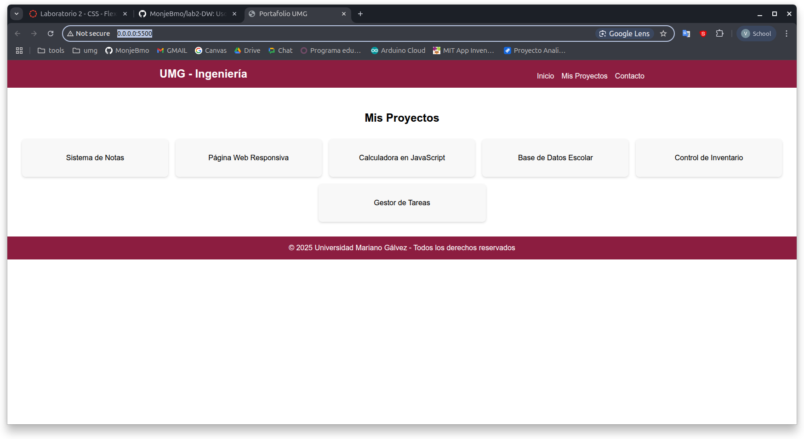

# Laboratorio – CSS Flexbox

**Curso:** Desarrollo Web
**Universidad Mariano Gálvez de Guatemala**
**Facultad de Ingeniería**

---

## Publicación del sitio en red local (LAN)

Durante el desarrollo del laboratorio, se implementó el despliegue del sitio web utilizando un servidor local accesible desde la red LAN de la Universidad. 

### **Captura de Pantalla**:

